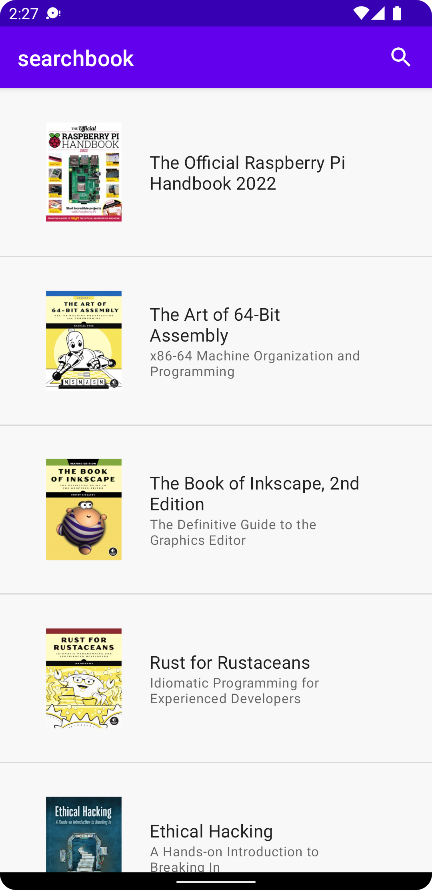
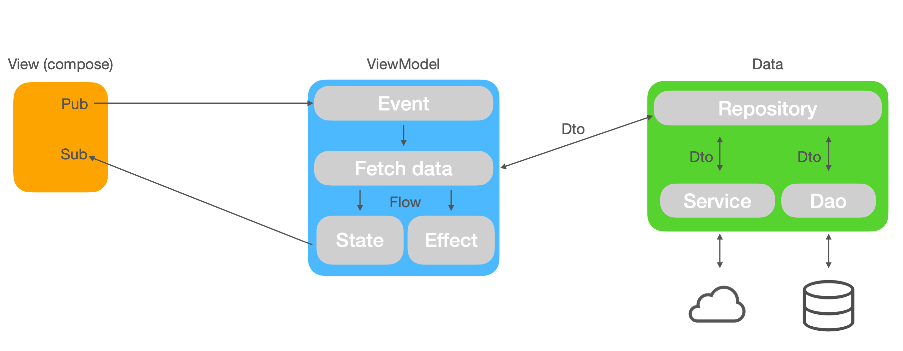

# SearchBooks

SearchBooks is an app built with Jetpack Compose and architecture of MVVM + MVI.

This sample showcases:
- Books Screen : the list of New Books
- Search of books Screen : the list of searched books
- Details of a book : the details of a selected book 

# Architecture
The project is layered with a View, Presentation, Model separation and presents a blend between MVVM and MVI.

Architecture layers:
* View 
* ViewModel 
* Model

* UI
    * [Compose](https://developer.android.com/jetpack/compose) declarative UI framework
    * [Material design](https://material.io/design)

* Tech/Tools
    * [Kotlin](https://kotlinlang.org/) 100% coverage
    * [Coroutines](https://kotlinlang.org/docs/reference/coroutines-overview.html) and [Flow](https://developer.android.com/kotlin/flow) for async operations
    * [Hilt](https://developer.android.com/training/dependency-injection/hilt-android) for dependency injection
    * [Jetpack](https://developer.android.com/jetpack)
        * [Compose](https://developer.android.com/jetpack/compose)
        * [Navigation](https://developer.android.com/topic/libraries/architecture/navigation/) for navigation between composables
        * [ViewModel](https://developer.android.com/topic/libraries/architecture/viewmodel) that stores, exposes and manages UI state
        * [Room](https://developer.android.com/topic/libraries/architecture/room) for local database
    * [Retrofit](https://square.github.io/retrofit/) for networking
    * [Coil](https://github.com/coil-kt/coil) for image loading
